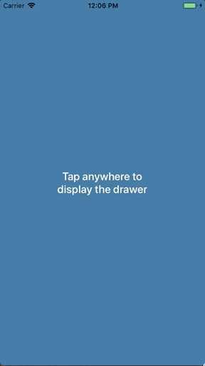

# DrawerKit

[](https://circleci.com)
[](https://github.com/Carthage/Carthage)
[](http://cocoapods.org/pods/DrawerKit)
[](http://cocoapods.org/pods/DrawerKit)
[](https://swift.org)
[](https://developer.apple.com/xcode)
[](http://cocoapods.org/pods/DrawerKit)

## What is DrawerKit?
__DrawerKit__ is a custom view controller presentation mimicking the kind of behaviour you see in the Apple Maps app.
It lets any view controller modally present another arbitrary view controller in such a way that the presented content
is only partially shown at first, then allowing the user to interact with it by showing more or less of that content
until it's fully presented or fully dismissed. It's *not* (yet) a complete implementation of the behaviour you see in
the Maps app simply because our specific needs dictated something else. We intend to continue working on it to address
that limitation.

Please do play with the demo app and try different configuration options because there are so many ways to configure
`DrawerKit` that the gif below is at most a pathetic representation of everything that the library can do.

<p align="center">
	<table>
		<tr>
			<td>
				<a href="https://github.com/Babylonpartners/DrawerKit/">
					
				</a>
			</td>
			<td>
				<a href="https://github.com/Babylonpartners/DrawerKit/">
					
				</a>
			</td>
			<td>
				<a href="https://github.com/Babylonpartners/DrawerKit/">
					
				</a>
			</td>
		</tr>
	</table>
</p>

## What's new in version 0.6.0?

## v. 0.6.0

- DrawerKit now supports pull-to-dismiss driven by a `UIScrollView` inside the drawer content.

  You may specify the `UIScrollView` to DrawerKit through its presentation controller:
  ```swift
  override func viewWillAppear(_ animated: Bool) {
    super.viewWillAppear(animated)

    // Install `tableView` as the pull-to-dismiss participant.
    drawerPresentationController?.scrollViewForPullToDismiss = tableView
  }
  ```
- Drawer corners may now be configured in `DrawerConfiguration` to be always visible below the status bar.

## What's new in version 0.5.0?

- DrawerKit now supports `overCurrentContext` and `overFullScreen` modal presentations over the drawer.
- Fixed the issue of touches on the drawer being cancelled by the DrawerKit internal gesture recognizers.
- `UIControl`s within the drawer are now interactive when the drawer is partially expanded.

## What's new in version 0.4.1?

- Reverses the fix for the [issue](https://github.com/Babylonpartners/DrawerKit/issues/31) about safe areas.
The fix broke other things and the issue will need to be re-opened.
- Changes the minimum deployment target to 10.2.

## What's new in version 0.4.0?

- Drawers can now have borders and shadows, all configurable.
- Fixed a bug by which dragging the drawer all the way to the top would not execute the animation completion block.
- Fixed a reported [issue](https://github.com/Babylonpartners/DrawerKit/issues/31) by which safe area insets were misbehaving.
- Removed the configuration parameter `hasHandleView` since it can be inferred from the value of `handleViewConfiguration`, which is now an optional.
- Fixed incorrect spelling in an enumeration case (`DrawerConfiguration.FullExpansionBehaviour.doesNotCoverStatusBar`)

## What version of iOS does it require or support?

__DrawerKit__ is compatible with iOS 10 and above.

## How to use it?

In order for the _presenting_ view controller to present another view controller (the _presented_ view controller)
as a drawer, some object needs to conform to the `DrawerCoordinating` protocol and the _presented_ view controller
needs to conform to the `DrawerPresentable` protocol. The _presenting_ view controller _may_ be the object conforming
to `DrawerCoordinating` but it need not be.

```swift
public protocol DrawerCoordinating: class {
    /// An object vended by the conforming object, whose responsibility is to control
    /// the presentation, animation, and interactivity of/with the drawer.
    var drawerDisplayController: DrawerDisplayController? { get }
}

public protocol DrawerPresentable: class {
    /// The height at which the drawer must be presented when it's in its
    /// partially expanded state. If negative, its value is clamped to zero.
    var heightOfPartiallyExpandedDrawer: CGFloat { get }
}
```

After that, it's essentially business as usual in regards to presenting a view controller modally. Here's the basic
code to get a view controller to present another as a drawer, where the presenting view controller itself conforms to
`DrawerCoordinating`,

```swift
extension PresenterViewController {
    func doModalPresentation() {
        guard let vc = storyboard?.instantiateViewController(withIdentifier: "presented")
            as? PresentedViewController else { return }

        // you can provide the configuration values in the initialiser...
        var configuration = DrawerConfiguration(/* ..., ..., ..., */)

        // ... or after initialisation. All of these have default values so change only
        // what you need to configure differently. They're all listed here just so you
        // can see what can be configured. The values listed are the default ones,
        // except where indicated otherwise.
        configuration.totalDurationInSeconds = 3 // default is 0.4
        configuration.durationIsProportionalToDistanceTraveled = false
        // default is UISpringTimingParameters()
        configuration.timingCurveProvider = UISpringTimingParameters(dampingRatio: 0.8)
        configuration.fullExpansionBehaviour = .leavesCustomGap(gap: 100) // default is .coversFullScreen
        configuration.supportsPartialExpansion = true
        configuration.dismissesInStages = true
        configuration.isDrawerDraggable = true
        configuration.isFullyPresentableByDrawerTaps = true
        configuration.numberOfTapsForFullDrawerPresentation = 1
        configuration.isDismissableByOutsideDrawerTaps = true
        configuration.numberOfTapsForOutsideDrawerDismissal = 1
        configuration.flickSpeedThreshold = 3
        configuration.upperMarkGap = 100 // default is 40
        configuration.lowerMarkGap =  80 // default is 40
        configuration.maximumCornerRadius = 15

        var handleViewConfiguration = HandleViewConfiguration()
        handleViewConfiguration.autoAnimatesDimming = true
        handleViewConfiguration.backgroundColor = .gray
        handleViewConfiguration.size = CGSize(width: 40, height: 6)
        handleViewConfiguration.top = 8
        handleViewConfiguration.cornerRadius = .automatic
        configuration.handleViewConfiguration = handleViewConfiguration

        let borderColor = UIColor(red: 205.0/255.0, green: 206.0/255.0, blue: 210.0/255.0, alpha: 1)
        let drawerBorderConfiguration = DrawerBorderConfiguration(borderThickness: 0.5,
                                                                  borderColor: borderColor)
        configuration.drawerBorderConfiguration = drawerBorderConfiguration

        let drawerShadowConfiguration = DrawerShadowConfiguration(shadowOpacity: 0.25,
                                                                  shadowRadius: 4,
                                                                  shadowOffset: .zero,
                                                                  shadowColor: .black)
        configuration.drawerShadowConfiguration = drawerShadowConfiguration

        drawerDisplayController = DrawerDisplayController(presentingViewController: self,
                                                          presentedViewController: vc,
                                                          configuration: configuration,
                                                          inDebugMode: true)

        present(vc, animated: true)
    }
}
```

and here's one way to implement the corresponding presented view controller:

```swift
extension PresentedViewController: DrawerPresentable {
    var heightOfPartiallyExpandedDrawer: CGFloat {
        guard let view = self.view as? PresentedView else { return 0 }
        return view.dividerView.frame.origin.y
    }
}
```

Naturally, the presented view controller can dismiss itself at any time, following the usual approach:

```swift
extension PresentedViewController {
    @IBAction func dismissButtonTapped() {
        dismiss(animated: true)
    }
}
```

## How configurable is it?

__DrawerKit__ has a number of configurable properties, conveniently collected together into a struct,
`DrawerConfiguration`. Here's a list of all the currently supported configuration options:

```swift
    /// The total duration, in seconds, for the drawer to transition from its
    /// collapsed state to its fully-expanded state, or vice-versa. The default
    /// value is 0.4 seconds.
    public var totalDurationInSeconds: TimeInterval

    /// When the drawer transitions between its collapsed and partially-expanded
    /// states, or between its partially-expanded and its fully-expanded states, in
    /// either direction, the distance traveled by the drawer is some fraction of
    /// the total distance traveled between the collapsed and fully-expanded states.
    /// You have a choice between having those fractional transitions take the same
    /// amount of time as the full transition, and having them take a time that is
    /// a fraction of the total time, where the fraction used is the fraction of
    /// space those partial transitions travel. In the first case, all transitions
    /// have the same duration (`totalDurationInSeconds`) but different speeds, while
    /// in the second case different transitions have different durations but the same
    /// speed. The default is `false`, that is, all transitions last the same amount
    /// of time.
    public var durationIsProportionalToDistanceTraveled: Bool

    /// The type of timing curve to use for the animations. The full set of cubic
    /// Bezier curves and spring-based curves is supported. Note that selecting a
    /// spring-based timing curve may cause the `totalDurationInSeconds` parameter
    /// to be ignored because the duration, for a fully general spring-based timing
    /// curve provider, is computed based on the specifics of the spring-based curve.
    /// The default is `UISpringTimingParameters()`, which is the system's global
    /// spring-based timing curve.
    public var timingCurveProvider: UITimingCurveProvider

    /// Whether the drawer expands to cover the entire screen, the entire screen minus
    /// the status bar, or the entire screen minus a custom gap. The default is to cover
    /// the full screen.
    public var fullExpansionBehaviour: FullExpansionBehaviour

    /// When `true`, the drawer is presented first in its partially expanded state.
    /// When `false`, the presentation is always to full screen and there is no
    /// partially expanded state. The default value is `true`.
    public var supportsPartialExpansion: Bool

    /// When `true`, dismissing the drawer from its fully expanded state can result
    /// in the drawer stopping at its partially expanded state. When `false`, the
    /// dismissal is always straight to the collapsed state. Note that
    /// `supportsPartialExpansion` being `false` implies `dismissesInStages` being
    /// `false` as well but you can have `supportsPartialExpansion == true` and
    /// `dismissesInStages == false`, which would result in presentations to the
    /// partially expanded state but all dismissals would be straight to the collapsed
    /// state. The default value is `true`.
    public var dismissesInStages: Bool

    /// Whether or not the drawer can be dragged up and down. The default value is `true`.
    public var isDrawerDraggable: Bool

    /// Whether or not the drawer can be fully presentable by tapping on it.
    /// The default value is `true`.
    public var isFullyPresentableByDrawerTaps: Bool

    /// How many taps are required for fully presenting the drawer by tapping on it.
    /// The default value is 1.
    public var numberOfTapsForFullDrawerPresentation: Int

    /// Whether or not the drawer can be dismissed by tapping anywhere outside of it.
    /// The default value is `true`.
    public var isDismissableByOutsideDrawerTaps: Bool

    /// How many taps are required for dismissing the drawer by tapping outside of it.
    /// The default value is 1.
    public var numberOfTapsForOutsideDrawerDismissal: Int

    /// How fast one needs to "flick" the drawer up or down to make it ignore the
    /// partially expanded state. Flicking fast enough up always presents to full screen
    /// and flicking fast enough down always collapses the drawer. A typically good value
    /// is around 3 points per screen height per second, and that is also the default
    /// value of this property.
    public var flickSpeedThreshold: CGFloat

    /// There is a band around the partially expanded position of the drawer where
    /// ending a drag inside will cause the drawer to move back to the partially
    /// expanded position (subjected to the conditions set by `supportsPartialExpansion`
    /// and `dismissesInStages`, of course). Set `inDebugMode` to `true` to see lines
    /// drawn at those positions. This value represents the gap *above* the partially
    /// expanded position. The default value is 40 points.
    public var upperMarkGap: CGFloat

    /// There is a band around the partially expanded position of the drawer where
    /// ending a drag inside will cause the drawer to move back to the partially
    /// expanded position (subjected to the conditions set by `supportsPartialExpansion`
    /// and `dismissesInStages`, of course). Set `inDebugMode` to `true` to see lines
    /// drawn at those positions. This value represents the gap *below* the partially
    /// expanded position. The default value is 40 points.
    public var lowerMarkGap: CGFloat

    /// The animating drawer also animates the radius of its top left and top right
    /// corners, from 0 to the value of this property. Setting this to 0 prevents any
    /// corner animations from taking place. The default value is 15 points.
    public var maximumCornerRadius: CGFloat

    /// The configuration options for the handle view, should it be shown. Set this
    /// property to `nil` to hide the handle view. The default value is
    /// `HandleViewConfiguration()`.
    public var handleViewConfiguration: HandleViewConfiguration?

    /// The configuration options for the drawer's border, should it be shown. Set this
    /// property to `nil` so as not to have a drawer border. The default value is `nil`.
    public var drawerBorderConfiguration: DrawerBorderConfiguration?

    /// The configuration options for the drawer's shadow, should it be shown. Set this
    /// property to `nil` so as not to have a drawer shadow. The default value is `nil`.
    public var drawerShadowConfiguration: DrawerShadowConfiguration?
```

```swift
    public enum FullExpansionBehaviour: Equatable {
        case coversFullScreen
        case dosNotCoverStatusBar
        case leavesCustomGap(gap: CGFloat)
    }
```

```swift
public struct HandleViewConfiguration {
    /// Whether or not to automatically dim the handle view as the drawer approaches
    /// its collapsed or fully expanded states. The default is `true`. Set it to `false`
    /// when configuring the drawer not to cover the full screen so that the handle view
    /// is always visible in that case.
    public var autoAnimatesDimming: Bool

    /// The handle view's background color. The default value is `UIColor.gray`.
    public var backgroundColor: UIColor

    /// The handle view's bounding rectangle's size. The default value is
    /// `CGSize(width: 40, height: 6)`.
    public var size: CGSize

    /// The handle view's vertical distance from the top of the drawer. In other words,
    /// the constant to be used when setting up the layout constraint
    /// `handleView.topAnchor.constraint(equalTo: presentedView.topAnchor, constant: top)`
    /// The default value is 8 points.
    public var top: CGFloat

    /// The handle view's corner radius. The default is `CornerRadius.automatic`, which
    /// results in a corner radius equal to half the handle view's height.
    public var cornerRadius: CornerRadius
}
```

```swift
public struct DrawerBorderConfiguration {
    /// The drawer's layer’s border thickness. The default value is 0,
    /// so effectively the default is not to have any border at all.
    public let borderThickness: CGFloat

    /// The drawer's layer’s border's color. The default value is `nil`, so
    /// effectively the default is not to have any border at all.
    public let borderColor: UIColor?

    public init(borderThickness: CGFloat = 0, borderColor: UIColor? = nil)
}
```

```swift
public struct DrawerShadowConfiguration {
    /// The drawer's layer’s shadow's opacity. The default value is 0, so
    /// effectively the default is not to have any shadow at all.
    public let shadowOpacity: CGFloat

    /// The blur radius (in points) used to render the drawer's layer’s shadow.
    /// The default value is 0, so effectively the default is not to have any
    /// shadow at all.
    public let shadowRadius: CGFloat

    /// The offset (in points) of the drawer's layer’s shadow. The default value is
    /// `CGSize.zero`, so effectively the default is not to have any shadow at all.
    public let shadowOffset: CGSize

    /// The drawer's layer’s shadow's color. The default value is `nil`, so
    /// effectively the default is not to have any shadow at all.
    public let shadowColor: UIColor?

    public init(shadowOpacity: CGFloat = 0,
                shadowRadius: CGFloat = 0,
                shadowOffset: CGSize = .zero,
                shadowColor: UIColor? = nil)
}
```

## What's the actual drawer behaviour logic?

The behaviour of how and under what situations the drawer gets fully presented, partially presented, or
collapsed (dismissed) is summarised by the pseudo-code below:

```swift
    if isMovingUpQuickly { show fully expanded }
    if isMovingDownQuickly { collapse all the way (ie, dismiss) }

    if isAboveUpperMark {
        if isMovingUp || isNotMoving {
            show fully expanded
        } else { // is moving down
            collapse to the partially expanded state or all the way (ie, dismiss),
            depending on the values of `supportsPartialExpansion` and `dismissesInStages`
        }
    }

    if isAboveLowerMark { // ie, in the band surrounding the partially expanded state
        if isMovingDown {
            collapse all the way (ie, dismiss)
        } else { // not moving or moving up
            expand to the partially expanded state or all the way (ie, full-screen),
            depending on the value of `supportsPartialExpansion`
        }
    }

    // below the band surrounding the partially expanded state
    collapse all the way (ie, dismiss)
```

#### Carthage

If you use [Carthage][] to manage your dependencies, simply add
DrawerKit to your `Cartfile`:

```
github "Babylonpartners/DrawerKit" ~> 1.0
```

If you use Carthage to build your dependencies, make sure you have added `DrawerKit.framework`
to the "_Linked Frameworks and Libraries_" section of your target, and have included them in
your Carthage framework copying build phase.

#### CocoaPods

If you use [CocoaPods][] to manage your dependencies, simply add DrawerKit to your `Podfile`:

```
pod 'DrawerKit', '~> 1.0'
```

[CocoaPods]: https://cocoapods.org/
[Carthage]: https://github.com/Carthage/Carthage
