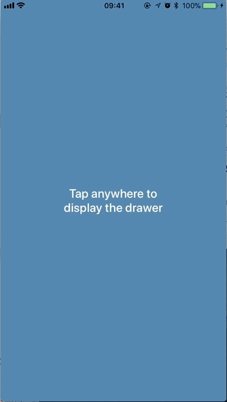

# DrawerKit

[](https://circleci.com)
[](https://github.com/Carthage/Carthage)
[](http://cocoapods.org/pods/DrawerKit)
[](http://cocoapods.org/pods/DrawerKit)
[](https://swift.org)
[](https://developer.apple.com/xcode)
[](http://cocoapods.org/pods/DrawerKit)

## What is DrawerKit?
__DrawerKit__ is a custom view controller presentation mimicking the kind of behaviour you see in the Apple Maps app.
It lets any view controller modally present another arbitrary view controller in such a way that the presented content
is only partially shown at first, then allowing the user to interact with it by showing more or less of that content
until it's fully presented or fully dismissed. It's *not* (yet) a complete implementation of the behaviour you see in
the Maps app simply because our specific needs dictated something else. We intend to continue working on it to address
that limitation.

<p align="center">
	<a href="https://github.com/Babylonpartners/DrawerKit/">
	    
	</a>
</p>

## What version of iOS does it require or support?

__DrawerKit__ is compatible with iOS 10 and above.

## How to use it?

In order for the _presenting_ view controller to present another view controller (the _presented_ view controller)
as a drawer, both view controllers need to conform to specific protocols, as follows.

The presenting view controller needs to conform to the `DrawerPresenting` protocol,

```swift
public protocol DrawerPresenting: class {
    /// An object vended by the presenting view controller, whose responsibility
    /// is to coordinate the presentation, animation, and interactivity of/with
    /// the drawer.
    var drawerDisplayController: DrawerDisplayController? { get }
}
```

and the presented view controller needs to conform to the `DrawerPresentable` protocol,

```swift
public protocol DrawerPresentable: class {
    /// The height at which the drawer must be presented when it's in its
    /// partially expanded state. If negative, its value is clamped to zero.
    var heightOfPartiallyExpandedDrawer: CGFloat { get }
}
```

After that, it's essentially business as usual in regards to presenting a view controller modally. Here's the basic
code to get a view controller to present another as a drawer:

```swift
extension PresenterViewController {
    func doModalPresentation() {
        guard let vc = storyboard?.instantiateViewController(withIdentifier: "presented")
            as? PresentedViewController else { return }

        // you can provide the configuration values in the initialiser...
        var configuration = DrawerConfiguration(/* ..., ..., ..., */)

        // ... or after initialisation
        configuration.durationInSeconds = 0.8
        configuration.timingCurveProvider = UISpringTimingParameters(dampingRatio: 0.8)
        configuration.supportsPartialExpansion = true
        configuration.dismissesInStages = true
        configuration.isDrawerDraggable = true
        configuration.isDismissableByOutsideDrawerTaps = true
        configuration.numberOfTapsForOutsideDrawerDismissal = 1
        configuration.flickSpeedThreshold = 3
        configuration.upperMarkGap = 30
        configuration.lowerMarkGap = 30
        configuration.maximumCornerRadius = 20

        drawerDisplayController = DrawerDisplayController(presentingViewController: self,
                                                          presentedViewController: vc,
                                                          configuration: configuration)

        present(vc, animated: true)
    }
}
```

and here's one way to implement the corresponding presented view controller:

```swift
extension PresentedViewController: DrawerPresentable {
    var heightOfPartiallyExpandedDrawer: CGFloat {
        guard let view = self.view as? PresentedView else { return 0 }
        return view.dividerView.frame.origin.y
    }
}
```

Naturally, the presented view controller can dismiss itself at any time, following the usual approach:

```swift
extension PresentedViewController {
    @IBAction func dismissButtonTapped() {
        dismiss(animated: true)
    }
}
```

## How configurable is it?

__DrawerKit__ has a number of configurable properties, conveniently collected together into a struct,
`DrawerConfiguration`. Here's a list of all the currently supported configuration options:

```swift
    /// How long the animations that move the drawer up and down last.
    /// The default value is 0.3 seconds.
    public var durationInSeconds: TimeInterval

    /// The type of timing curve to use for the animations. The full set
    /// of cubic Bezier curves and spring-based curves is supported. Note
    /// that selecting a spring-based timing curve causes the `durationInSeconds`
    /// parameter to be ignored, because the duration is computed based on the
    /// specifics of the spring-based curve. The default is `UISpringTimingParameters()`,
    /// which is the system's global spring-based timing curve.
    public var timingCurveProvider: UITimingCurveProvider

    /// When `true`, the drawer is presented first in its partially expanded state.
    /// When `false`, the presentation is always to full screen and there is no
    /// partially expanded state. The default value is `true`.
    public var supportsPartialExpansion: Bool

    /// When `true`, dismissing the drawer from its fully expanded state can result
    /// in the drawer stopping at its partially expanded state. When `false`, the
    /// dismissal is always straight to the collapsed state. Note that
    /// `supportsPartialExpansion` being `false` implies `dismissesInStages` being
    /// `false` as well but you can have `supportsPartialExpansion == true` and
    /// `dismissesInStages == false`, which would result in presentations to the
    /// partially expanded state but all dismissals would be straight to the collapsed
    /// state. The default value is `true`.
    public var dismissesInStages: Bool

    /// Whether or not the drawer can be dragged up and down. The default value is `true`.
    public var isDrawerDraggable: Bool

    /// Whether or not the drawer can be dismissed by tapping anywhere outside of it.
    /// The default value is `true`.
    public var isDismissableByOutsideDrawerTaps: Bool

    /// How many taps are required for dismissing the drawer by tapping outside of it.
    /// The default value is 1.
    public var numberOfTapsForOutsideDrawerDismissal: Int

    /// How fast one needs to "flick" the drawer up or down to make it ignore the
    /// partially expanded state. Flicking fast enough up always presents to full screen
    /// and flicking fast enough down always collapses the drawer. A typically good value
    /// is around 3 points per screen height per second, and that is also the default
    /// value of this property.
    public var flickSpeedThreshold: CGFloat

    /// There is a band around the partially expanded position of the drawer where
    /// ending a drag inside will cause the drawer to move back to the partially
    /// expanded position (subjected to the conditions set by `supportsPartialExpansion`
    /// and `dismissesInStages`, of course). Set `inDebugMode` to `true` to see lines
    /// drawn at those positions. This value represents the gap *above* the partially
    /// expanded position. The default value is 40 points.
    public var upperMarkGap: CGFloat

    /// There is a band around the partially expanded position of the drawer where
    /// ending a drag inside will cause the drawer to move back to the partially
    /// expanded position (subjected to the conditions set by `supportsPartialExpansion`
    /// and `dismissesInStages`, of course). Set `inDebugMode` to `true` to see lines
    /// drawn at those positions. This value represents the gap *below* the partially
    /// expanded position. The default value is 40 points.
    public var lowerMarkGap: CGFloat

    /// The animating drawer also animates the radius of its top left and top right
    /// corners, from 0 to the value of this property. Setting this to 0 prevents any
    /// corner animations from taking place. The default value is 15 points.
    public var maximumCornerRadius: CGFloat
```

## What's the actual drawer behaviour logic?

The behaviour of how and under what situations the drawer gets fully presented, partially presented, or
collapsed (dismissed) is summarised by the pseudo-code below:

```swift
    if isMovingUpQuickly { show fully expanded }
    if isMovingDownQuickly { collapse all the way (ie, dismiss) }

    if isAboveUpperMark {
        if isMovingUp || isNotMoving {
            show fully expanded
        } else { // is moving down
            collapse to the partially expanded state or all the way (ie, dismiss),
            depending on the values of `supportsPartialExpansion` and `dismissesInStages`
        }
    }

    if isAboveLowerMark { // ie, in the band surrounding the partially expanded state
        if isMovingDown {
            collapse all the way (ie, dismiss)
        } else { // not moving or moving up
            expand to the partially expanded state or all the way (ie, full-screen),
            depending on the value of `supportsPartialExpansion`
        }
    }

    // below the band surrounding the partially expanded state
    collapse all the way (ie, dismiss)
```

#### Carthage

If you use [Carthage][] to manage your dependencies, simply add
DrawerKit to your `Cartfile`:

```
github "Babylonpartners/DrawerKit" ~> 0.0.1
```

If you use Carthage to build your dependencies, make sure you have added `DrawerKit.framework`
to the "_Linked Frameworks and Libraries_" section of your target, and have included them in
your Carthage framework copying build phase.

#### CocoaPods

If you use [CocoaPods][] to manage your dependencies, simply add DrawerKit to your `Podfile`:

```
pod 'DrawerKit', '~> 0.0.1'
```

[CocoaPods]: https://cocoapods.org/
[Carthage]: https://github.com/Carthage/Carthage
